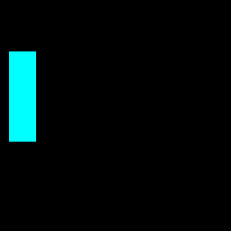

# pixel-render

Small opinionated game engine focusing on simplicity.

Features

- Pixel renderer
- Keyboard and mouse input
- Ability to screenshot and create gifs

### Minimal example

```rust
const WIDTH: u32 = 256;
const HEIGHT: u32 = 256;

struct Game {}

impl Callbacks for Game {
    fn init(&self, ctx: &mut Context) {
        canvas::resize(ctx, WIDTH, HEIGHT);
    }

    fn update(&mut self, ctx: &mut Context, _dt: f32) -> bool {
        canvas::clear_screen(ctx);

        let (px, py) = (75, 75);
        let (wx, wy) = (100, 100);
        for y in 0..wx {
            for x in 0..wy {
                canvas::write_pixel_rgb(ctx, x + px, y + py, &[0, 255, 255]);
            }
        }

        false
    }
}

fn main() {
    let app = Game {};
    pixel_renderer::run(app);
}
```

Output


More examples can be seen in [examples](https://github.com/stofffe/pixel-renderer/tree/main/examples).

### Projects using pixel-renderer

- [Software raymarcher](https://github.com/stofffe/software-raymarcher)
